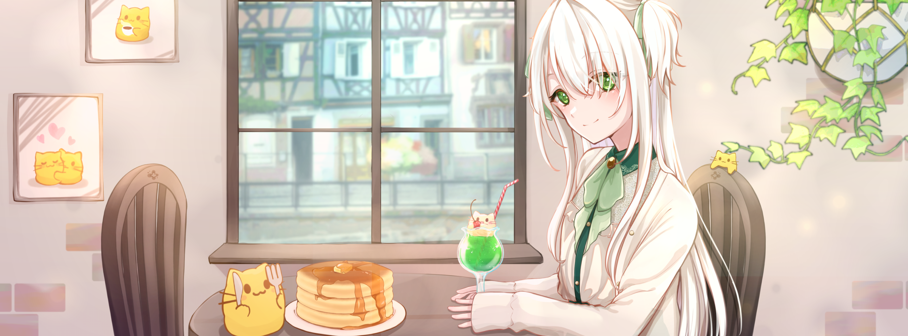

## ねこづきあゆむ

WEB、デザイン、企画などいろいろ創っています

### 自己紹介

2002年9月3日、鹿児島生まれ、茨城在住。

エンジニアとして仕事をしつつ、気になったことを発信したり、創作活動をしたりしています。気になることが多すぎて、手を広げすぎてしまうことが悩みです。

好きなものは『スイーツ』『紅茶』『ねこ』『Summer Pockets』『少女☆歌劇 レヴュースタァライト』『Rewrite』など。苦手なものは『辛いもの』『虫』とか。

同人サークル『モモツキ桃源郷』にて、評論系同人誌の頒布やポッドキャスト配信なども行っています。

詳しくは ▷ [nekozuki.me](https://nekozuki.me) 

---

[nekozuki.me](https://nekozuki.me) | [リンク](https://nekozuki.me/links) | [お問い合わせ](https://nekozuki.me/contact)